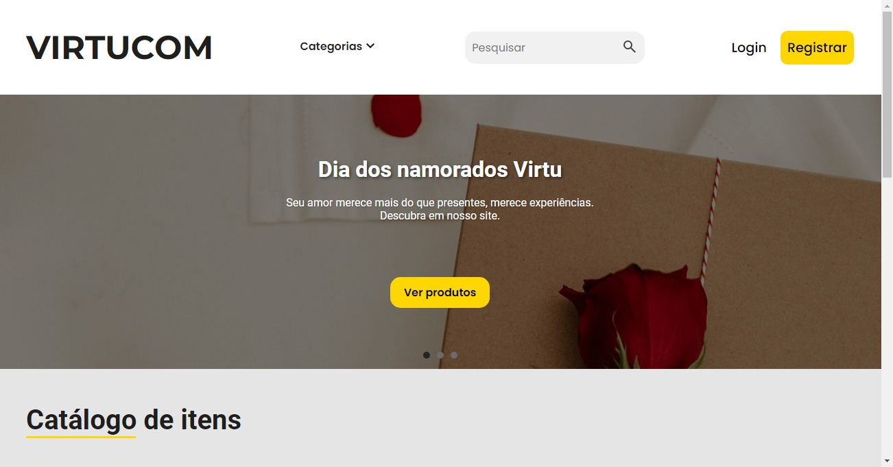

# VirtuCOM

Uma loja virtual feita para a máteria de Front-end da faculdade

## Explicacao

O VirtuCOM é uma loja em que você irá conseguir se cadastrar e fazer login com usuário, fora o cadastro de item e visualizar o total no carrinho

## Autores

- [@RodriguesGS](https://github.com/RodriguesGS)

## Imagem inical

    <h1><a href="https://virtucom.vercel.app" target="_blank">Live demo</a></h1>

## Funcionalidades

- Register e login no localStorage
- Caso você faça login com usuário de "admin", você irá entrar na tela de painel de controle de adminstrador
- Na tela de administrador, você é capaz de cadastrar itens com nome, descrição e preço, nessa tela você também é capaz de editar os itens que já tem cadastrado
- Caso você logue com qualquer outro usuário você irá entrar na tela de usuário, nela você poderá visualizar os itens cadastrados e adicionar eles no carrinho
- Dentro do carrinho, você verá uma lista de todos os itens que foram colocados no carrinho e o total, nele terá o botão de ir para a tela de pagamento
- Na tela de pagamento você precisará colocar os dados que pede e poderá finalizar compra

## Stack utilizada

**Front-end:** HTML, CSS, Javascript